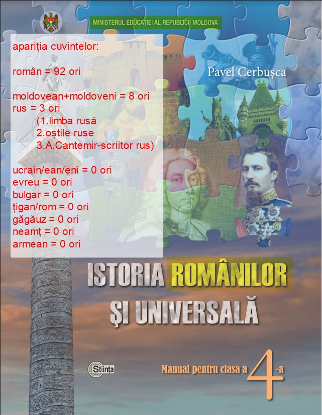
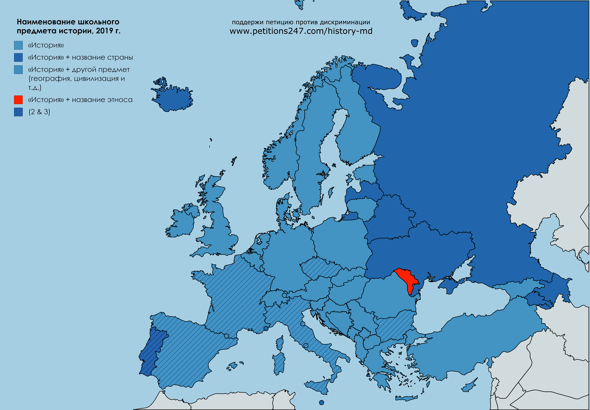

Исследование: 
# Дискриминация в наименовании школьного предмета национальной истории в Молдове 
в контексте этнического разнообразия и равенства учащихся

> Эта статья является механическим переводом с [оригинала на молдавском языке](md). 

### Преамбула
Данный документ представляет собой исследование на тему наличия этнической дискриминации учащихся в школах Республики Молдова Министерством просвещения. Министерство внедрило в школьную программу обязательный предмет для всех учеников Республики Молдова - "История Румын...". - названный в честь одной единственной этнической группы (на долю которой по результатам последней национальной переписи населения приходится 6,9% населения страны). В нем будут проанализированы история, текущая ситуация, национальное и международное законодательство в этой области, практика других стран.

Мы проанализируем в качестве источника дискриминации только **название** предмета истории, не высказывая своего мнения о *содержании* учебников, что является предметом, возможно, более сложного и субъективного исследования. Содержание учебников истории не является предметом данного исследования и не ставит своей целью их изменение, хотя авторы, очевидно, также хотели бы видеть сбалансированное содержание, освещающее объективные факты, а не личное отношение авторов. Однако содержание учебников будет проанализировано очень кратко, чтобы понять суть проблемы и лучше объяснить суть вопроса о наименовании школьного предмета.

## 1. Общие вопросы
Для родителей и студентов, считающих себя евреями, молдаванами, украинцами, русскими, гагаузами, это время глубокого замешательства - объяснять своим детям в раннем возрасте, почему они должны изучать "румын".
На наш взгляд, ситуация была бы не лучше, если бы этот предмет назывался "История молдаван", "История украинцев" или "История цыган" - в любом случае, этнические чувства других этнических групп были бы задеты, и они почувствовали бы, что являются "особыми" этническими группами, историю которых по тем или иным причинам не стоит включать в название школьного предмета.

Если в Республике Молдова есть *официальный язык*, закрепленный в Конституции республики, то в законодательстве нет *официальной этнической/национальной принадлежности*.

Переписи населения 1989, 2004, 2014 годов показывают, что большинство населения Республики Молдова - 69-76% - идентифицируют себя как молдавской национальности/этнической принадлежности. Национальный/этнический состав населения Республики Молдова в следующей таблице отражает официальные данные Национальной переписи населения 2004 и 2014 годов: 

Рис. 1 - Таблица, представляющая различные национальности/этнические группы в Республике Молдова (источник: Национальное бюро статистики Молдовы, statistica.md, Результаты переписи населения 2014 года)_

Следует напомнить, что переписи фиксируют личное заявление граждан относительно их этнической/национальной принадлежности, поэтому именно самоидентификация - единственный современный метод определения этнической принадлежности человека, взятый отдельно. Сумма личных самоидентификаций представляет собой демократический, независимый, научно адаптированный метод идентификации, количественного измерения и анализа этнических групп в сообществе. 

Из таблицы видно, что в последней переписи, в 2014 году, молдаване объявили себя 73,5% граждан, румыны - 6,9%, украинцы - 6,5%, гагаузы - 4,5%, русские - 4% и т.д. Подчеркнем, что это прямое, необработанное, заявленное мнение граждан. Не применяется субъективный фильтр отдельных "экспертов" или "научных", политических или иных групп.

**Молдова остается единственной страной в Европе (возможно, в мире) с этническим элементом в названии школьного предмета истории.** *Ни одна другая европейская страна не включает этнический элемент в название школьного предмета истории ([источник](https://dudnic.com/2019/11/22/denumirea-obiectului-scolar-de-istorie.html)). Нет. Как и Румыния.*

## 2.	Определения
### 2.1 Этническая и национальная принадлежность 
В данном документе мы рассматриваем понятия "этническая принадлежность" и "национальность" как равнозначные. Это связано с тем, что в национальных документах (свидетельствах о рождении, национальных переписях и т.д.) нет разницы между этими понятиями, по принципу: одна национальность - несколько национальностей (этносов). 
### 2.2 Дискриминация 
Мы рассматриваем **этническую дискриминацию** как, включая, но не ограничиваясь, *предпочтение/дискриминацию одной группы граждан по отношению к другим группам граждан на основе этнических/национальных критериев, что имеет следствием предоставление преимущества этой группе перед другими в выражении основных прав и свобод человека, в частности, право на инклюзивное образование, право человека решать, к какой этнической группе он принадлежит или не принадлежит, изучение общего исторического прошлого, признание существования и участия людей и этнических групп, к которым они принадлежат или считают себя принадлежащими, в формировании прошлого общего государства - Республики Молдова*.

Мы считаем это определение соответствующим следующим национальным и международным или иностранным правовым текстам: 

* **Закон об обеспечении равенства** (№ 121 от 25.05.2012 - [источник](http://lex.justice.md/md/343361/)), определяет следующие термины: 
> * _дискриминация_ - любое различие, исключение, ограничение или предпочтение в правах и свободах человека или группы лиц, а также поддержка дискриминационного поведения на основе фактических критериев, предусмотренных настоящим Законом, или на основе предполагаемых критериев;  
* _прямая дискриминация_ - обращение с человеком на основании любого из запрещающих критериев менее благоприятным образом, чем обращение с другим человеком в сравнимой ситуации;  
> косвенная дискриминация_ - любое внешне нейтральное положение, действие, критерий или практика, которые имеют эффект ущемления одного лица по отношению к другому лицу на основании критериев, предусмотренных настоящим Законом, если только это положение, действие, критерий или практика объективно не оправданы законной целью, а средства достижения этой цели пропорциональны, уместны и необходимы;  
> дискриминация по ассоциации" - любой акт дискриминации, совершенный в отношении лица, которое, хотя и не принадлежит к категории лиц, определенной в соответствии с критериями, изложенными в настоящем Законе, ассоциируется с одним или несколькими лицами, принадлежащими к такой категории;  
> * _расовая сегрегация_ - любое действие или бездействие, которое прямо или косвенно приводит к разделению или дифференциации людей по признаку расы, цвета кожи, национального или этнического происхождения;  
> * _домогательство_ - любое нежелательное поведение, которое приводит к созданию запугивающей, враждебной, унижающей, унизительной или оскорбительной обстановки с целью или следствием нарушения достоинства человека на основе критериев, предусмотренных настоящим законом;

* **Международная конвенция о ликвидации всех форм расовой дискриминации** ([источник](https://lege5.ro/Gratuit/he2damby/conventia-internationala-privind-eliminarea-tuturor-formelor-de-discriminare-rasiala-din-21121965)) определяет ***расовую дискриминацию*** как "*любое различие, исключение, ограничение или предпочтение по признаку расы, цвета кожи, родового, национального или этнического происхождения, целью или результатом которого является умаление или отрицание признания, пользования или осуществления на равной основе прав человека и основных свобод в политической, экономической, социальной, культурной или любой другой области общественной жизни".

* Румынское законодательство, используется, в Постановлении Правительства № 137/2000, о предотвращении и наказании всех форм дискриминации, в ст.2, схожее определение, дискриминация - это "*любое различие, исключение, ограничение или предпочтение, основанное на расе, национальности, этнической принадлежности, [...] убеждениях, [...] или любом другом критерии, которое имеет целью или следствием ограничение или устранение признания, использования или осуществления на равной основе прав человека и основных свобод или прав, признанных законом, в политической, экономической, социальной и культурной областях или в любой другой области общественной жизни*". 

В частности, из этого можно сделать вывод, что "расовая дискриминация" также может быть определена как "предпочтение по признаку национального или этнического происхождения, которое имеет своим следствием ограничение или аннулирование равного признания основных прав и свобод".

*в реальности* подтверждается, что предпочтение, отдаваемое Министерством просвещения румынской национальности в рамках школьного предмета истории, ставит под угрозу осуществление на равных условиях права детей Республики Молдова на познание прошлого своей этнической/национальной принадлежности в общем пространстве всех граждан Республики Молдова. Что касается названия или содержания национального учебника истории, то участие других этнических групп значительно ограничено, практически исключено. Это "предпочтение", а также "ограничение" засвидетельствовано как в названии учебника/школьного предмета, так и в содержании учебников и школьных программ, как мы увидим ниже.

* В Румынии Постановление № 6134/2016 *о запрете школьной сегрегации в учреждениях довузовского образования*, статья 3, определяет сегрегацию как "*серьезную форму дискриминации и приводит к неравному доступу детей к качественному образованию, нарушению равного осуществления права на образование и человеческого достоинства*".

* **Народный юридический словарь** Джеральда и Кэтлин Хилл определяет [дискриминацию](https://dictionary.law.com/Default.aspx?selected=532) как "*неравное обращение с людьми по причине, не имеющей отношения к юридическим правам или возможностям*";

К нерумынским этническим/национальным группам применяется неравное отношение в названии и содержании национального учебника истории, и это не имеет никакого отношения к правам или правоспособности этих этнических/национальных групп.

* Во **французском законодательстве** в [законе о борьбе с дискриминацией и трудовом кодексе](https://www.legifrance.gouv.fr/affichTexte.do?cidTexte=JORFTEXT000000588617&categorieLien=id) говорится, что "*Ни один человек не может быть удален [...] по причине происхождения, [...] принадлежности или непринадлежности, действительной или предполагаемой, к этнической группе, нации или расе*".

Мы отмечаем практически отсутствие/удаление всех этносов из национального учебника истории, за исключением румынского, выраженное по той простой причине, что они практически не упоминаются в содержании этих учебников, как мы увидим ниже.

### 2.3 Дискриминированные субъекты
Перечислим, кто, по мнению инициативной группы, является субъектами, дискриминируемыми данным названием школьного предмета:

a) **дети**, граждане Республики Молдова, относящиеся к национальным/этническим меньшинствам, не румыны - поскольку они исключены из названия учебника в пользу румынской этнической группы;
b) дети, граждане Республики Молдова, принадлежащие к национальному/этническому (молдавскому) большинству, которые не считают себя румынами -  поскольку они исключены из названия учебника в пользу румынской этнической группы;
c) рассматриваемая потенциальная дискриминация охватывает весь период существования данного названия школьного предмета в Республике Молдова, т.е. практически за небольшими исключениями весь период недавней независимости Республики Молдова. Это означает, что в число дискриминируемых попадают не только нынешние ученики, но и все ученики, изучавшие этот предмет с 1990-х годов.
d) **семьи детей** из пункта (а), поскольку они обязаны прилагать дополнительные педагогические усилия в семье и объяснять детям, почему их тоже нет на обложке учебника истории;
e) семьи детей из пункта (b). Если молдавские семьи не считают себя румынами, они находятся в невыгодном положении по сравнению с семьями, соответствующими государственной идеологии, поскольку им приходится сталкиваться с двойной задачей преподавания и потенциальными конфликтами между учителями, учениками и родителями по поводу этой идеологии;
f) **учителя истории**, которые, независимо от национальности и собственного мнения по этому национальному предмету, обязаны преподавать историю так, как она видна с обложки учебника, т.е. исключительно историю румынского этноса. Как учитель истории, который не является или не считает себя румыном, относится к преподаванию истории румын как своей собственной истории и страны в которой он живёт? Является ли Республика Молдова страной Румын, или страной всех свойх граждан, вне зависимости от национальности?

Семьи, которые не хотят обучать своих детей в стиле Министерства образования, подвергаются дискриминации по сравнению с другими семьями, которые соответствуют государственной идеологии. А именно, родители нерумынских молдаван должны приложить дополнительные дидактические усилия, чтобы противостоять идеологии, навязываемой Министерством, и объяснить свою точку зрения, которая будет находиться в постоянной конкуренции с идеями, предлагаемыми учителями и учебником истории. Это ставит конформистские и нонконформистские семьи в неравные условия с государственной идеологией. Эта ситуация может стать источником дальнейшей потенциальной напряженности между этими молдавскими учениками и их родителями, между молдавскими учениками и учителями, а также между молдавскими учениками и учениками, считающими себя румынами.

Существование государственной идеологии, согласно которой молдаване являются румынами, и ее выражение через название школьного предмета, способствует повышенному риску конфликтов между родителями и детьми, между родителями и учителями, между детьми, которые считают себя румынами, и теми, кто не считает, что приводит к путанице и напряженности в классах школ республики.

## 3. Правовая база
Изучаются следующие национальные и международные документы, предполагающие нарушения со стороны Министерства (источники документов, доступных в Интернете, указаны ниже):

### 3.1 Международное законодательство

Сегрегация детей в школах описывается Советом Европы как "наихудшая форма
дискриминацию и серьезное нарушение прав соответствующих детей" [(источник, стр.5)](https://rm.coe.int/fighting-school-segregationin-europe-throughinclusive-education-a-posi/168073fb65). Хотя все государства-члены взяли на себя ответственность за ликвидацию этнической сегрегации в школах, факты на местах с тревогой свидетельствуют не только о сохранении сегрегации, но и о том, что на европейском уровне процент сегрегированных школ и классов увеличился. 

#### 3.1.1 ООН
* **Международная конвенция о ликвидации всех форм расовой дискриминации** ([источник](https://lege5.ro/Gratuit/he2damby/conventia-internationala-privind-eliminarea-tuturor-formelor-de-discriminare-rasiala-din-21121965))

В дополнение к определению "расовой дискриминации" в предыдущем пункте, Конвенция также упоминает: 

> Ст.4 Государства-участники [...] обязуются [...] c)не позволять государственным органам или государственным учреждениям, национальным или местным, подстрекать или поощрять расовую дискриминацию.

*в реальности*, параллельно с образованием, ориентированным на румынскую идентичность (и, в частности, на предмет национальной истории), можно наблюдать умножение ассоциаций, групп и партий, целью которых является сегрегация этнических румын в рамках румынского национального государства, различные русофобские демонстрации, в частности, протесты у российских посольств, на разделительной линии с Приднестровским регионом и т.д. Авторы считают, что этноцентрическое воспитание способствует возникновению в обществе крайне негативных чувств к одним народам или этносам и позитивных/сострадательных чувств к другим.

> Статья 7 обязывает подписавшие ее государства "принять немедленные и эффективные меры в области образования, обучения, культуры и информации для борьбы с предрассудками, ведущими к расовой дискриминации, и для содействия взаимопониманию, терпимости и дружбе между нациями и расовыми или этническими группами".

* **Конвенция ЮНЕСКО о борьбе с дискриминацией в области образования 1960** ([источник MD](https://lege5.ro/Gratuit/g43danrs/conventia-privind-lupta-impotriva-discriminarii-in-domeniul-invatamintului-adoptata-la-paris-la-14-decembrie-1960), [Конвенция о борьбе с дискриминацией в области образования 1960](http://portal.unesco.org/en/ev.php-URL_ID=12949&URL_DO=DO_TOPIC&URL_SECTION=201.html))
> Ст.3 В целях ликвидации или предупреждения любой дискриминации [...] государства-участники обязуются:  
> (a) отменить любые законодательные и административные положения и положить конец любой административной практике, которая может повлечь за собой дискриминацию в области образования;

Эта статья, использованная ЕСПЧ в деле приднестровских учителей против Молдовы и России в отношении школ с латинской графикой, вероятно, может быть применена в данном деле, если будет подтверждено, что название, данное учебнику Министерством образования, дискриминирует этнических нерумын, исключая их, и отдает предпочтение румынам, предоставляя им эксклюзивное место на обложке. 

Этот вопрос может представлять собой нарушение этнических прав населения Республики Молдова, а также, возможно, нарушение прав детей на справедливое образование.

* **Всеобщая декларация прав человека** ([источник](https://www.ohchr.org/EN/UDHR/Documents/UDHR_Translations/rum.pdf), [Universal Declaration of Human Rights](https://www.un.org/en/universal-declaration-human-rights/))
> Ст.26(2): Образование должно быть направлено на всестороннее развитие человеческой личности и на укрепление уважения к правам человека и основным свободам. Оно должно способствовать взаимопониманию, терпимости и дружбе между всеми народами и всеми расовыми группами [...] 
> (3) Родители имеют право приоритета в выборе образования для своих несовершеннолетних детей.

*в реальности* - толерантность и дружба между народами не стоит на повестке дня, потому что другие народы даже не упоминаются в учебнике истории, который анализируется. Все, начиная с названия и заканчивая содержанием, сосредоточено на румынской этнической принадлежности. 
Для примера я взял содержание учебника по истории - "Румынская и всеобщая история: учебник для 4 класса / Павел Чербушка; Мин. упр. Образование представителя. Молдова - Ч.: Î.E.P. Science, 2016". После лексического анализа текста учебника можно с удивлением отметить, что *слово "молдавский"/"молдаване" в учебнике встречается 8 раз, слово "русский" встречается трижды ("русский" язык, "русские войска" и "русский писатель"), слова "украинец/ан/ени", "еврей", "болгарин", "цыган/ром", "гагауз", "немец", "армянин" не встречаются ни разу (! ), в то время как слово "румынский" встречается в различных формах 92 раза* !

  

Рис.2 Пример статистики из учебника "Румынская история"

Аналогичную статистику можно найти в [учебной программе по истории для средней школы, 2019](https://mecc.gov.md/sites/default/files/iru_liceu.pdf), где меньшинства не упоминаются вообще (например, "украинский", "еврейский", "болгарский" не упоминается ни разу), слово "молдавский/en" упоминается только один раз, "русский" только в связи с Империей, в то время как "румынский/романский" упоминается сотни раз.  

Приоритет родителей также не учитывается: все дети, независимо от мнения родителей, учат исключительно о румынах, то есть этническая индоктринация детей происходит в школе, независимо от позиции родителей, выраженной дома, что приводит детей к путанице и необходимости выбирать между школой и родителями, если их мнения расходятся. 

* **Декларация Генеральной Ассамблеи ООН о правах коренных народов** - [Декларация ООН о правах коренных народов, EN](https://www.un.org/esa/socdev/unpfii/documents/DRIPS_en.pdf) [RU](https://www.un.org/esa/socdev/unpfii/documents/DRIPS_ru.pdf)

> Ст.14(2) Лица из числа коренных народов, особенно дети, имеют право на все уровни и формы образования государства без дискриминации. (3) Государства совместно с коренными народами принимают эффективные меры, чтобы лица из числа коренных народов, особенно дети, включая тех, кто живет вне их общин, имели доступ, когда это возможно, к образованию в рамках их собственной культуры и предоставляемому на их родном языке.

*в реальности*, несмотря на результаты национальной переписи, министерство навязывает националистические клише коренному населению, явно заявленному статистикой как "молдаване", навязывая этноним "румын" от имени объекта истории. Отметим, что те же клише применимы и к национальным объектам языка (согласно статье 13 Конституции объявленного "молдавским") и литературы, но они не являются предметом настоящего обращения. 

> Ст.15(1) Коренные народы имеют право на достоинство и разнообразие своих культур, традиций, истории и чаяний, которые должны быть надлежащим образом отражены в образовании и общественной информации. (2) Государства принимают эффективные меры, в консультации и сотрудничестве с соответствующими коренными народами, для борьбы с предрассудками и ликвидации дискриминации и для содействия терпимости, пониманию и хорошим отношениям между коренными народами и всеми другими сегментами общества.

*в реальности* - достоинство молдаван, которые не считают себя румынами, не уважается. С предрассудками не только не борются, но они укореняются и формализуются школьной программой. Доктрина включения молдаван в число румын посредством языка, истории и литературы отражает болезненную и последовательную тенденцию к индоктринации со стороны чиновников министерства. Дошло до того, что даже дети в Румынии уже не изучают историю "румын", но чиновники Министерства просвещения Республики Молдова сохраняют эту идеологию, оставаясь, возможно, последними в мире, и уж точно последними в Европе, с таким обозначением предмета.  

> Ст.31(1) Коренные народы имеют право сохранять, контролировать, защищать и развивать свое культурное наследие, традиционные знания и традиционные формы культурного самовыражения [...] устные традиции, литературу [...]. (2) Совместно с коренными народами государства принимают эффективные меры для признания и защиты осуществления этих прав.

*в реальности* - молдавские народные выражения и традиции, традиционное использование названия молдавского языка, этноса, народа и нации, как это было принято и [письменное свидетельство](https://dudnic.com/2020/06/08/moldovenesc.html) которого мы имеем, по крайней мере, с 16 века, систематически заменяются терминами "румынский/эск", потому что именно это министерская элита считает, по их мнению, более правильным. Название молдавского языка, которое использовалось на протяжении как минимум 5 веков, изымается из употребления, вопреки переписи населения и мнению большинства общественности. Название молдавской этнической принадлежности заменяется на румынскую этническую принадлежность. Эта концепция также лежит в основе названия национального объекта истории, который рассматривается как часть борьбы с непопулярным советским прошлым. Название молдавской национальности и молдавский язык стали жертвами борьбы научной элиты против советского прошлого. Эти безальтернативные клише преподносятся студентам как единственная истина. Таким образом, не только этнические меньшинства в Республике Молдова практически исключены из учебников истории, но и молдавское большинство подвергается методичной индоктринации в последние десятилетия независимости. 

* **Конвенция ООН о правах ребенка** ([от 20 ноября 1989 года](http://www.cdep.ro/pls/legis/legis_pck.htp_act_text?idt=28213), [Конвенция ООН о правах ребенка](https://en.wikisource.org/wiki/United_Nations_Convention_on_the_Rights_of_the_Child))
> Ст.2(1) Государства-участники обязуются уважать права, изложенные в настоящей Конвенции, и обеспечивать их всем детям, находящимся под их юрисдикцией, без какой бы то ни было дискриминации, независимо от [...] общественного или иного мнения ребенка или его родителей или законных опекунов, или его национального, этнического или социального происхождения [...] или его рождения или иного статуса.  
> (2) Государства-участники принимают все соответствующие меры для обеспечения того, чтобы ребенок был эффективно защищен от любой формы дискриминации или санкций на основании правового статуса, деятельности, заявленных мнений или убеждений его родителей, законных опекунов или членов семьи.  
> Ст.8(1) Государства-участники обязуются уважать право ребенка на сохранение своей личности [...].

*в реальности* отмечается, что идентичность молдавских семей, которые не считают себя румынами, заменяется румынской идентичностью. Название официального курса национальной истории не оставляет сомнений в этом отношении: история принадлежит "румынам", что занимает место чисто молдавской идентичности этих семей. Дети румынской национальности являются единственной этнической группой, чья национальность фигурирует в названии обязательного школьного предмета, поэтому при изучении этого предмета дети оказываются в неравных условиях.

* Открывая скобку, можно также напомнить о **резолюции 60/7 Генеральной Ассамблеи ООН**, посвященной памяти жертв Холокоста, которая призывает (пункт 2) страны-члены развивать образовательные программы в этом отношении. 

*в реальности* - ни слово "Холокост", ни даже слово "еврей(ы)" не встречается в содержании упомянутого выше учебника истории. Таким образом, память об одном из самых чудовищных преступлений, совершенных в истории человечества, замалчивается. Мы закрываем эту скобку, которая не относится непосредственно к названию объекта истории, а скорее к содержанию учебника, но которая показывает, что если, символически, бюрократы позволяют себе использовать такое однобокое название на обложке учебника, то содержание не может быть более толерантным или многосторонним. 

#### 3.1.2 Совет Европы
> "Во многих странах может существовать тенденция со стороны групп давления, слоев общественного мнения или политиков использовать историю как средство вызвать чувство превосходства и, в некоторых случаях, ненависть к "другим", будь то государства или группы этнических меньшинств".  
[Отчет СЕ, "Совет Европы и история в школах", Энн Лоу-Бир, Страсбург, 1997](https://rm.coe.int/1680494436)

История изучается во всех европейских странах. Большинство предметов называется "История", в некоторых случаях в название включается и название страны, но ни в одной стране (по крайней мере, в Европе) за пределами Молдовы не указывается национальность: ([study](https://www.dudnic.com/2019/11/denumirea-obiectului-scolar-de-istorie.html)) 
Рис.3 Название школьного предмета истории в европейских странах

Изучение истории является обязательным для учеников в возрасте от 10 до 14 лет во всех школах Европы, с различиями в начальном этапе обучения (в 5, 7 или 10 лет) и возрасте, когда история становится факультативным предметом (14, 15 или 17 лет). Другие различия касаются количества учебного времени, выделяемого в неделю (от 45 до более 90 минут), формы обучения - предметной или интегрированной - и схемы построения учебного плана: линейной, концентрической или спиральной. С другой стороны, другие общие элементы, зафиксированные в исследовании, касаются общих тенденций в отношении целей изучения истории - понимание учениками мира, в котором они живут, вклад в развитие европейского гражданства и критического мышления, а также переход от хронологических критериев организации содержания к тематическим (EUROCLIO, 2003, [ссылка](http://hiphi.ubbcluj.ro/studii/Public/File/cursuri/suporturi_conversie/Didactica-istoriei_I.pdf)).

Ниже приведен неполный список конвенций Совета Европы и правовых документов, которые могут быть нарушены Министерством образования:

* **Европейская конвенция по правам человека** ([source md](https://www.echr.coe.int/documents/convention_ron.pdf), [European Convention on Human Rights](https://www.echr.coe.int/documents/convention_ENG.pdf))
> Ст.8 *Право на уважение частной и семейной жизни*  
> (1) Каждый человек имеет право на уважение его личной и семейной жизни [...].  
> (2) Вмешательство государственного органа в осуществление этого права допускается только в той мере, в какой такое вмешательство предусмотрено законом и необходимо в демократическом обществе в интересах национальной безопасности, общественной безопасности, экономического благосостояния страны, для охраны общественного порядка и предотвращения преступлений, для охраны здоровья и нравственности и для защиты прав и свобод других лиц.

*в реальности* мы наблюдаем прямое участие государства в делах семьи. В частности, право родителей на воспитание своих детей как этнических молдаван ущемляется навязываемой в школьных учебниках идеологией, согласно которой этнические молдаване на самом деле являются румынами. Это выражено и в названии школьного предмета истории. 

> Ст.9 *Свобода мысли, совести и религии*.  
> (1) Каждый человек имеет право на свободу мысли и совести [...]; это право включает свободу менять свои убеждения [...] и свободу исповедовать свои убеждения как единолично, так и сообща с другими, публичным или частным порядком в богослужении, учении, практической деятельности [...].  
> (2) Вмешательство государственного органа в осуществление этого права допускается только в той мере, в какой оно предусмотрено законом и является в демократическом обществе необходимой мерой для обеспечения национальной безопасности, общественной безопасности, экономического благосостояния страны, охраны общественного порядка и предотвращения уголовных преступлений, охраны здоровья, нравственности, прав и свобод других лиц.

*в реальности* мы наблюдаем, что свобода мысли ограничена названием школьного предмета истории, который обозначает официальную теорию "румынизма". Эта навязанная теория не имеет никакого вмешательства в национальную безопасность, общественную безопасность или другие элементы, перечисленные в пункте 2 настоящей статьи. Соответственно, такое вмешательство государства ограничивает свободу мнений и свободу мысли детей в Республике Молдова. 

> * Дополнительный протокол (1)  
> Статья 2 *Право на образование*  
> Никому не может быть отказано в праве на образование. Государство при осуществлении функций, которые оно берет на себя в области образования и обучения, уважает право родителей обеспечивать такое образование и обучение в соответствии с их религиозными и философскими убеждениями.  
> Ст.14 *Запрет дискриминации*  
> Осуществление прав и свобод, признаваемых в настоящей Конвенции, должно быть обеспечено без дискриминации по какому бы то ни было признаку, такому, в частности, как [...], убеждения [...], национальное происхождение [...], принадлежность к национальному меньшинству [...].
> * Протокол № 12; Ст.1 * Общий запрет дискриминации
> 1. Осуществление любого права, предусмотренного законом, обеспечивается без дискриминации по какому-либо признаку, такому как [...] язык, убеждения [...], национальное происхождение [...], принадлежность к национальному меньшинству [...] или любой другой статус.  
> 2. Никто не должен подвергаться дискриминации со стороны государственного органа по любому из оснований, указанных в пункте 1.

*в реальности* констатируется, что государство игнорирует убеждения значительной части населения, считающей себя молдаванами, игнорирует философские концепции многих родителей, подписавших эту петицию, которые не согласны с тем, что их дети должны получать образование как этнические румыны. Налицо явное разделение по национальному признаку. Этнические меньшинства полностью отсутствуют в проанализированных нами учебниках истории, аккредитованных Министерством просвещения Молдовы. 

* **Рамочная конвенция о защите национальных меньшинств** ([md](http://www.anr.gov.ro/docs/legislatie/internationala/Conventia_Cadru_pentru_Protectia_Minoritatilor_Nationale.pdf), [Рамочная конвенция о защите национальных меньшинств](https://www.coe.int/en/web/minorities/text-of-the-convention))
> Ст.5(2) [...] Стороны воздерживаются от любой политики или практики, направленной на ассимиляцию лиц, принадлежащих к национальным меньшинствам, против их воли и защищают таких лиц от любых действий, направленных на такую ассимиляцию.

*в реальности* можно отметить, что Конвенция не запрещает *добровольную* ассимиляцию, есть свидетельства того, что граждане Республики Молдова выступают против практики этноцентризма: например, петиция ["За историю Молдовы"](https://www.petitieonline.com/history-md), подписанная тысячами людей, отношение, которое можно увидеть в комментариях к данной петиции, где подписавшиеся выражают свое мнение по этому вопросу.

> Ст.6(1) Стороны поощряют [...] терпимость и диалог [...] между всеми лицами, проживающими на их территории, независимо от этнической, культурной или языковой принадлежности [...], _в частности, в области образования_....

> Статья 7 Стороны обеспечивают уважение прав [...] на _свободу мысли_...

> Ст.12 Стороны [...] принимают меры в области образования и научных исследований для поощрения знания культуры, истории, языка и религии как своих национальных меньшинств, так и большинства.

*в реальности* национальная система образования монополизировала изучение истории одного национально-этнического компонента, который даже не является большинством. 

> При осуществлении прав и свобод [...] каждое лицо, принадлежащее к национальному меньшинству, должно уважать [...] права [...] большинства или других национальных меньшинств.
 
*в реальности* видно, что люди в Республике Молдова, идентифицирующие себя как "румыны", очевидно, навязали монополию на систему образования и на идеи и убеждения, изложенные в учебной литературе для учеников, принадлежащих как к другим меньшинствам, так и к большинству - молдавскому [см. Закон о меньшинствах] - населения. Именно из-за этого государственный язык был переименован Министерством просвещения в "румынский" из официального "молдавского", вместо "Истории Молдовы" дети изучают "Историю румын", а предмет Литература также называется "Румынская литература", без консультаций и прислушивания к широкой общественности и мнению большинства населения, выраженному посредством национальных переписей.

##### 3.1.3 Рекомендации Парламентской Ассамблеи Совета Европы

* **Рекомендация 15 (2001) по преподаванию истории в Европе в 21 веке** ([источник MD](http://www.istorie-bucuresti.ro/e107_files/downloads/Documente%20scolare/Recomandarea%2015%20-2001%20-%20predarea%20istoriei%20in%20Europa%20in%20sec.21.pdf), [Рекомендация Rec(2001)15 EN](https://search.coe.int/cm/Pages/result_details.aspx?ObjectID=09000016805e2c31))
> Приложение 1. [...]  
>- дать возможность ученикам развить интеллектуальные способности для анализа и интерпретации
критически и ответственно относиться к исторической информации, используя диалог, исторические факты и открытые дебаты, основываясь на многочисленных точках зрения на историю, особенно на спорные и деликатные вопросы;
>- дать возможность гражданам Европы сформировать и утвердить свою собственную индивидуальную и коллективную идентичность [...];

*в реальности* мы видим следующее: 
- спорным и деликатным вопросом является _национальная идентичность_. Идея о том, что идентичность является "румынской", навязывается ученику прямо из названия учебника. Какой же это критический анализ или диалог?
- "Граждане Европы" в Республике Молдова называются "румынами" в соответствии с названием учебника. Это клише появляется перед ребенком даже при закрытом учебнике, прямо с обложки. О какой "собственной" идентичности может мечтать ученик-гражданин, считающий себя молдаванином, а не румыном? Это клише, навязанное некоторыми националистическими академическими кругами, рассматривается министерством как единственно верное и официально пропагандируемое в школьных учебниках.

> "2. Манипулирование историей  
Преподавание истории не должно быть инструментом идеологических манипуляций, пропаганды или использоваться для продвижения нетерпимых, ультранационалистических, ксенофобских или антисемитских идей".

*в реальности* мы видим следующее: 
- идеология "румынской" этничности (пропагандируемая ультранационалистическими академическими и политическими кругами), предлагается молодому ученику прямо и без обиняков, с самой обложки учебника, продвигая идею, что единственная история, которую стоит изучать на национальном уровне - это история румынской этничности, доказательством чего является тот факт, что название учебника включает единственный и неповторимый этноним: "румын" до исключения других этнических элементов в контексте национальной истории многонационального народа Республики Молдова, в том числе, и, возможно, особенно для студентов, которые хотели бы утвердить идентичность большинства - "молдавский", независимо от того, считают ли они ее отличной от "румынской" или нет. Такие "неправильные" идеи искореняются с самого начала и поощряются, к ним относятся с иронией и презрением, проявляя свою дискриминацию, отсюда и такой подход к власти.

- Название учебника истории продвигает идею о том, что "национальная" - "национальная история" - эквивалентна "румынской" - "истории румын". Таким образом, мнение большинства молдаван, выраженное в национальных переписях, относительно их национальной идентичности - "молдавский" - явно игнорируется. 

- Этот контраст между академическим националистическим мнением и реальностью на местах создает питательную среду для чувства непонимания, ненависти, нетерпимости к людям, не разделяющим "румынскую" теорию идентичности большинства населения Республики Молдова, взаимных обвинений, этноцентрических маршей и демонстраций, радикализации мнений, выражаемых публично и в социальных сетях.

* **Рекомендация 1111/1989 о европейском измерении образования** ([Recommendation 1111 (1989)](http://assembly.coe.int/nw/xml/XRef/Xref-XML2HTML-en.asp?fileid=15145&lang=en)), говорит нам, что "европейское измерение образования, Европа распространяется на весь континент" (стр.5) и что образование должно способствовать "познанию "других"". [народы, нации, н.р.](пункт 2)

*в реальности* - "знание других" в основном сводится к "румынам". Уважение к чужой культуре виртуально, потому что "другие" даже не упоминаются в учебнике. Понятие гражданин Республики Молдова в значительной степени заменено понятием этнический румын, и это прямо следует из обложки учебника, названия учебника и навязанного Министерством просвещения школьного предмета.

* В Рекомендации 98/5 Комитета министров Совета Европы об образовании в связи с сохранением исторического наследия** ([fr](http://geapolis.eu/Doc21.pdf), [Recommendation No. R(98)5](https://rm.coe.int/16804f1ca1)) говорится, что "одной из задач образования является обучение молодежи уважению культур в их разнообразии, гражданственности и демократии", и что "культурное наследие является результатом вклада и обменов из различных источников и периодов".

*в реальности* - если речь идет об "общем наследии", то из содержания учебника, и особенно из названия, не должно исключаться наследие, оставленное другими этническими группами - этот недостаток с грустью отмечается в настоящее время при просмотре учебников, изданных под эгидой национального министерства образования.  
Многосторонность не поощряется, а предпочтение отдается одной точке зрения на историю - вся информация - начиная с названия учебника - сосредоточена на *румынском национальном этноцентризме*, а все истоки ограничиваются культурой и вкладом румын, другие истоки культурного наследия Республики Молдова не упоминаются ни в остаточной форме. 

* **Рекомендация № 1353** (1998) Парламентской Ассамблеи Совета Европы о доступе меньшинств к школьному образованию ([источник EN](https://assembly.coe.int/nw/xml/XRef/Xref-XML2HTML-en.asp?fileid=16579&lang=en)) гласит, что "меньшинства должны иметь возможность выражать свою самобытность и развивать свое образование, культуру, язык и традиции, и что государства должны принимать все необходимые меры для этого". Более того, это единственный способ для Европы сохранить свое богатое культурное разнообразие".

* **Рекомендация ЕС 1283 (1996) об истории и преподавании истории в Европе** [источник](http://www.istorie-bucuresti.ro/download.php?view.23) гласит, что 
История "*может способствовать лучшему пониманию, терпимости и доверию между людьми и между народами Европы - или она может стать силой разделения, насилия и нетерпимости", что преподавание истории не должно быть "заучиванием исторических событий, принимаемых за чистую монету", а должно быть "способом развития критического подхода и демократического отношения", толерантным и граждански ответственным", о "необходимости достижения взаимопонимания и более глубокого доверия между народами, в частности, путем разработки учебной программы по истории, исключающей предрассудки и стереотипы и подчеркивающей роль позитивного взаимовлияния между различными странами, религиями и идеями в историческом развитии Европы*".

*в реальности* - мы видим прямо на обложке учебника истории стереотип (продвигаемый некоторыми академиками и ультраправыми политиками) о том, что молдаване - это румыны. Мы ничего не имеем против того, чтобы сообщить ученику, что такая теория существует и даже поддерживается многими учеными, но мы против уникальности этой идеи и отсутствия в учебнике альтернативных взглядов, которые также существуют в обществе и игнорируются учебниками. Давайте поищем в учебнике следы *положительных взаимовлияний* других стран, народов, кроме Румынии, на молдавский народ! К сожалению, внешнее влияние часто ограничивается депортациями и голодом в советский период, которые приписываются исключительно соседней нации. О положительном влиянии других народов или наций практически ничего не известно.
Об *основании* Молдавии и Валахии говорится (в том же учебнике, стр. 26), что это были "румынские" страны, тогда как в те годы еще не было известно исторических источников, которые бы подтверждали эти утверждения, а если такие источники и существуют, то они не приведены в учебнике. Ученик вынужден верить авторам на слово. Таким образом, стереотип мышления навязывается детям, чья способность анализировать и распознавать пропаганду еще только формируется.
Как мы можем бороться со стереотипами и ложью, когда официальный национальный праздник под названием "Наш язык" (см. Постановление 433 Верховного Совета МССР от 26 декабря 1990 года), отмечаемый 31 августа, описывается (на странице 47 того же пособия) как "Наш румынский язык"?!

Рис.4 Страница из учебника истории, добавляющая "румынский" к официальному названию национального праздника 31 августа

#### 3.1.4 ЕС

* **Меморандум об обучении на протяжении всей жизни**, составленный Европейским Союзом в 2000 году [источник MD](https://usarb.md/wp-content/uploads/2019/03/Memorandum-asupra-invatarii-permanente-din-30_10_2000_Bruxelles.pdf), [A Memorandum on Lifelong Learning, EN](https://uil.unesco.org/i/doc/lifelong-learning/policies/european-communities-a-memorandum-on-lifelong-learning.pdf) гласит (пункт 2), что "люди [...] должны научиться принимать культурное, этническое и языковое разнообразие". 

*в реальности* - этот принцип не отражен ни в названии школьного предмета, ни в содержании учебников по истории, ни в учебной программе по истории, принятой Министерством образования. Этническое "разнообразие" в учебниках и учебных программах ограничивается "румынским" языком, а в содержании учебников мы не находим ни языка, ни культуры меньшинств и почти не упоминаем об этих меньшинствах, как мы видели на примерах выше.

* * * Амстердамский договор** (1997) - позволяет всем государствам-членам Европейского сообщества принимать все необходимые средства для борьбы с дискриминацией по признаку этнической принадлежности или убеждений;

* **Хартия основных прав** Европейского Союза ([источник](https://eur-lex.europa.eu/legal-content/RO/TXT/HTML/?uri=CELEX:12012P/TXT&from=EN))
> Статьи 14 (право на образование в соответствии со своими убеждениями), 21 (недискриминация), 22 (разнообразие) и 24 (право детей на выражение своих взглядов).

* **Договор о функционировании Европейского Союза** [(MD)](https://eur-lex.europa.eu/legal-content/RO/TXT/?uri=celex:12012E/TXT)

> Ст.10 При определении и осуществлении своей политики и деятельности Союз стремится бороться с дискриминацией по признаку пола, расового или этнического происхождения [...].  
Ст.19 Совет [...] может принимать соответствующие меры для борьбы с любой дискриминацией по признаку пола, расового или этнического происхождения [...].  
Ст.21(1) Запрещается дискриминация любого рода по таким признакам, как [...] этническое или социальное происхождение, [...] убеждения, взгляды [...], принадлежность к национальному меньшинству, [...].  
(2) В пределах сферы применения Договоров и без ущерба для их конкретных положений запрещается любая дискриминация по признаку гражданства.  
Ст.24(1) Дети [...] могут свободно выражать свои взгляды. Это должно учитываться в вопросах, затрагивающих их интересы, в соответствии с их возрастом и степенью зрелости.  
(2) Во всех действиях в отношении детей, предпринимаемых как государственными органами, так и частными учреждениями, первоочередное внимание уделяется наилучшему обеспечению интересов ребенка.

* **Резолюция Европейского парламента от 7 февраля 2018 года** о защите и недискриминации меньшинств в государствах-членах ЕС (2017/2937(RSP)) [EN](https://eur-lex.europa.eu/legal-content/RO/TXT/HTML/?uri=CELEX:52018IP0032&qid=1599249280140&from=EN) указывает, что "дискриминация по признаку этнического происхождения упоминается как наиболее распространенная форма дискриминации".

#### 3.1.5 США
* [**Закон штата Вашингтон**](https://app.leg.wa.gov/RCW/default.aspx?cite=28A.230.020) налагает на школы следующие ограничения на учебные программы: "Все общеобразовательные школы должны предлагать обучение по [...], географии, истории Соединенных Штатов, английской грамматике, [...]", поэтому если школа требует "американскую историю" вместо "истории Соединенных Штатов", это может стать основанием для судебного разбирательства.

### 3.2 Национальное законодательство

* **Конституция Республики Молдова** 

> Ст.5(2) "Никакая идеология не может быть установлена в качестве официальной идеологии государства" 
 
*в реальности* - идеология "румынской идентичности" молдавского народа и языка официально и безальтернативно преподается в школах Республики Молдова, как по содержанию учебников, так и даже по их названию. У молдавских детей нет другого выбора, кроме как называть язык "румынским", литературу - "румынской", а историю - "румынской". Эта идея и сомнительная маркировка - единственная версия, которая навязывается молдавским детям. Национальные меньшинства практически исключены из этих объектов. У молдавского большинства нет другого выбора, кроме как принять эту государственную идеологию и подчиниться официальной индоктринации Министерства просвещения.
 
> Статья 10. Единство народа и право на самобытность
(1) Государство основано на единстве народа Республики Молдова. Республика Молдова является общей и неделимой родиной всех ее граждан.
(2) Государство признает и гарантирует право всех граждан на сохранение, развитие и выражение своей этнической самобытности[...].

*в реальности* - государство требует через образование на национальном уровне изучения румынской литературы и истории румын, хотя румыны не являются ни национальностью большинства, ни официальной государственной этнической или национальной принадлежностью. Официальный молдавский язык (статья 13 Конституции Республики Молдова), следуя той же тенденции, переименован и преподается детям как "румынский".

> Ст.16(2) "Все граждане Республики Молдова равны перед законом и органами государственной власти, независимо от [...] национальности, этнического происхождения..."

*в реальности* - румыны - единственные, чья история официально преподается в национальных школах.

> Ст.31(1) "Свобода совести гарантируется. Она должна выражаться в духе терпимости и взаимного уважения".

*в реальности* - свобода совести ограничена идеологией румынизма, официально преподаваемой в школьных учебниках. Отсутствие альтернативной государственной идеологии не способствует развитию свободы совести. Семьи, в которых точка зрения отличается от официальной, находятся в неблагоприятном положении по сравнению с теми, кто ей соответствует, поскольку дети из таких семей попадают в непонятные ситуации, и им требуется больше усилий для усвоения школьного материала.

* **Закон об обеспечении равенства** (№ 121 от 25.05.2012), уже упоминался выше с определением дискриминации. Другие пункты этого закона упоминают: 
> Серьезными формами дискриминации являются:  
    (a) поощрение или практика дискриминации со стороны государственных органов;  
    б) пропаганда дискриминации через средства массовой информации;  
    в) размещение дискриминационных сообщений и символов в общественных местах;  
    г) дискриминация лиц на основании двух или более критериев;  
    д) дискриминация со стороны двух или более лиц;  
    (f) дискриминация по двум или более признакам;  
    (g) дискриминация в отношении группы лиц;  
    (h) расовая сегрегация.

*в реальности* - Министерство образования, выделяет одну этническую/национальную группу на обложке учебников, которые появляются в классах национальных школ, публичных библиотеках и т.д.

Также существует множество СМИ, для которых сегрегация людей одной национальности в различных республиканских и внереспубликанских политических проектах стала нормой. Одной из главных причин такого маргинального поведения является национальное воспитание молодых граждан, которые черпают вдохновение в истории для построения будущего, уникальность которого неоспорима и альтернативность которого не исследуется системой исторического образования.

* **Закон о правах ребенка** (№ 338 от 15.12.1994 - [источник](https://www.legis.md/cautare/getResults?doc_id=94939&lang=ro)):
> * Ст.3 Все дети _равны_ в правах _независимо от национальности, этнического происхождения_, пола, языка, [...] убеждений...
> * Статья 6 Государство обеспечивает неприкосновенность личности ребенка, защищая его от любой формы [...] дискриминации...
> * Ст.8(1) Право ребенка на свободу мысли, мнения [...] не должно нарушаться никаким образом... 
> (2) Государство гарантирует ребенку [...] право свободно _выражать свои взгляды_ по любому затрагивающему его вопросу. Мнение ребенка, достигшего десятилетнего возраста, должно быть принято во внимание...
> (4) Ни один ребенок не должен быть _обязан_ придерживаться того или иного мнения [...] вопреки своим собственным убеждениям. _Свобода совести ребенка гарантируется_ государством...
> (5) Родители или законные опекуны имеют _право воспитывать ребенка в соответствии со своими убеждениями_.
> * Ст. 9. Государство предоставляет всем детям равные возможности и _равные условия для приобщения к культурным ценностям_...
> * Ст. 31(2) Если международным договором, стороной которого является Республика Молдова, установлены иные правила, чем те, которые содержатся в настоящем законе, применяются правила международного договора.

* **Закон о правах лиц, принадлежащих к национальным меньшинствам, и о правовом статусе организаций** (№ 382 от 19.07.2001 - [источник](http://lex.justice.md/index.php?action=view&view=doc&lang=1&id=312817))
> Демонстрируя приверженность _Всеобщей декларации прав человека_ [...] _Рамочной конвенции о защите национальных меньшинств_; [...] принимая во внимание этническое разнообразие [...] народа Республики Молдова [...]; исходя из международно-правовых принципов, согласно которым защита национальных меньшинств, прав и свобод лиц, принадлежащих к этим меньшинствам, является неотъемлемой частью защиты прав человека, Парламент принимает настоящий органический закон.  
> Для целей настоящего закона лица, принадлежащие к национальным меньшинствам, - это лица, которые [...] отличаются от большинства населения - молдаван - и считают себя лицами иного этнического происхождения.

*в реальности*, хотя закон говорит о большинстве населения как о молдаванах, Министерство просвещения, по не совсем обычным причинам, навязывает название предмета истории *румыны*. 

> Ст.2 Каждый человек, принадлежащий к национальному меньшинству, имеет право свободно выбирать, принадлежать ему к этому меньшинству или нет...

> Ст.6(4) Изучение молдавского языка и литературы, а также истории Молдовы во всех учебных заведениях является обязательным.

*в реальности* - *молдавская* история, *молдавский* язык и литература не преподаются в школах, они заменены бюрократами министерства на *румынскую* историю, *румынский* язык и литературу. 

### 3.3 Аналогичные судебные прецеденты в мире
* Браун против Совета по образованию
([EN](https://en.wikipedia.org/wiki/Brown_v._Board_of_Education),
[RU](https://ru.wikipedia.org/wiki/%D0%91%D1%80%D0%B0%D1%83%D0%BD_%D0%BF%D1%80
%D0%BE%D1%82%D0%B8%D0%B2_%D0%A1%D0%BE%D0%B2%D0%B5%D1%82%D0%B0_%
D0%BF%D0%BE_%D0%BE%D0%B1%D1%80%D0%B0%D0%B7%D0%BE%D0%B2%D0%B0%D0
%BD%D0%B8%D1%8E)) - судебное дело в США, признавшее неконституционным раздельное обучение белых и черных. Работа психологов Кеннета Б. Кларк, Мэйми Кларк, которая продемонстрировала, что сегрегация приводит к развитию детских комплексов и предрассудков. Можно также провести параллели с образованием в Республике Молдова, где выделение этнических румын в школьных учебниках может вызвать комплексы у детей других
национальностей, включая молдавское большинство.
* ЕСПЧ: Дело Кьельдсен, Буск Мадсен и Педерсен против Дании ([источник, EN](https://hudoc.echr.coe.int/eng?i=001-57509) об отказе следовать курсу полового воспитания детей в Дании (отклонено ЕСПЧ).
### 3.4 Национальное законодательство других государств
Определение и запрет этнической сегрегации присутствует в законодательстве нескольких европейских стран. Определения этнической сегрегации в разных странах обобщены в [настоящий документ, Приложение 3. стр. 107](https://www.migpolgroup.com/wpcontent/uploads/2020/04/Racial-discrimination-in-education-and-EU-equality-law.pdf).
#### *Определение сегрегации в образовании*.
* **Болгария**: Статья 5 и Дополнительное положение §1.6 Закона о защите от дискриминации Расовая сегрегация [...] считается дискриминацией, [и] означает издание акта, совершение действия или бездействие, которые ведут к принудительному разделению, дифференциации
или разобщению лиц на основании их [...] этнической принадлежности [...] .
* **Хорватия**: Статья 5, (1) и (2) Антидискриминационного закона Сегрегация должна [...] считаться дискриминацией [...] означающей [...] принудительное и систематическое разделение людей по любому из оснований, упомянутых в пункте 1 статьи 1 [Антидискриминационного
закона].
* **Унгария**: Статья 10 (2) и 27 (3) Антидискриминационного закона. Сегрегация - это поведение, направленное на отделение отдельных лиц или группы лиц от других лиц или другой группы лиц в сопоставимой ситуации на основании характеристики, определенной в
[антидискриминационном законе].

* **ВЕЛИКОБРИТАНИЯ**:
Закон о равенстве 2010 года Раздел 13 (1) и (5) Человек (А) дискриминирует другого (Б), если из-за защищенной характеристики А относится к Б менее благоприятно, чем А относится или относился бы к другим. Если защищаемой характеристикой является раса, менее
благоприятное обращение включает в себя сегрегацию В с другими. 
NI Орден о расовых отношениях 1997, ст. 3(2) Орден о расовых отношениях Отделение человека от других людей по расовому признаку означает обращение с ним менее благоприятное, чем с другими людьми.

В соседней Румынии после вступления страны в ЕС (2007) школьный предмет "История румын" был "европеизирован", что вызвало волну недовольства в академической среде страны [статья 03/02/2006](https://www.ziaruldeiasi.ro/iasi/laquo-istoria-romanilorraquo-va-disparea-ca-disciplinascolara-la-liceu~ni3un1)
В третьем отчете ЕКРН (Европейской комиссии против расизма и нетерпимости) по Румынии, принятом 24 июня 2005 года, отмечается ([стр. 81](https://rm.coe.int/third-report-on-romaniaromanian-translation-/16808b5b92)):
> "ЕКРН отмечает, что, несмотря на вышеуказанные меры, которые она приветствует, в
области образования еще многое предстоит сделать. Неправительственные организации попрежнему сожалеют о том, что румынские школьные учебники содержат стереотипы и предрассудки в отношении групп меньшинств. Некоторые учебники, например, продолжают описывать появление в Румынии "полчищ варваров-кочевников, которые пришли с востока, чтобы сеять ужас", а венгры иногда описываются как иностранцы, оккупировавшие
Трансильванию. ECRI также отмечает, что курс истории, который преподается румынским студентам, называется "История румын", а не "История Румынии". Представляется также, что, хотя из школьных учебников было удалено большинство оскорбительных упоминаний о
цыганах, их вкладу в развитие румынского общества по-прежнему уделяется слишком мало внимания."
Вот как Министерство образования и исследований отвечает на замечания ECRI
([источник](https://rm.coe.int/government-comments-on-the-third-report-on-romania-romaniantranslatio/16808b5b9b)):
> "Что касается названия предмета "История румын", а не "История Румынии", то отметим, что оно было установлено сразу после 1989 года и учитывало некоторые особенности национальной истории (название государства - Румыния - появилось в середине 19 века и, следовательно, "История Румынии" включала бы только последние полтора века). Однако, принимая во внимание рекомендации Совета Европы, Румыния ввела интегрированные курсы истории под названием "История" с 2004-2005 учебного года. С введением новых учебных программ для VIII и XII классов термин "румынская история" исчезнет в ближайшие годы. В новые учебные программы будут введены новые темы по истории меньшинств в Румынии и румынского меньшинства в соседних странах".
*Закон о национальном образовании 1/2011*, который гарантирует образование на основе принципа справедливости, гарантии культурной самобытности, признание и гарантии прав лиц, принадлежащих к национальным меньшинствам, право на сохранение, развитие и выражение своей этнической, культурной, языковой и религиозной самобытности, принцип обеспечения равных возможностей, принцип свободы мысли и независимости от идеологий, религиозных догм и политических доктрин, принцип социальной интеграции, принцип организации конфессионального образования в соответствии со специфическими требованиями каждой признанной религии (статья 3);

## 4. Что было сделано до сих пор для исправления ситуации

В 2005 году по просьбе молдавского правительства в Совет Европы Институт международного анализа учебников "Georg Eckert" в Брауншвейге дважды провел экспертизу рукописей интегрированных учебников по истории и представил молдавской стороне два отчета. В конце ноября 2005 года состоялась встреча с членами правительства и депутатами парламента, на которой обсуждалось внедрение интегрированного курса истории, основанного на рекомендациях Совета Европы. Тогдашний президент республики Владимир Воронин заявил, что эта мера является частью усилий Молдовы по приведению национальных образовательных стандартов в соответствие с европейскими. Правительство Молдовы запросило экспертизу новых учебников в середине 2005 года, отчет института "Георг Эккерт" был получен только в конце 2005 года. Впервые этот доклад был представлен авторам учебника на семинаре в Брауншвейге в декабре 2005 года. См. отчет о семинаре "Использование мультиперспективности в преподавании истории", Холеркань, Молдова, пятница 14 - суббота 15 июля 2006 года, доклад Штефана Ирига, Совет Европы, DGIV/EDU/HIST (2006) 04, стр. 9. Министр образования в то время, В. Țvircun, подписал в июле 2006 года приказ о введении с 1 сентября 2006 года курса "интегрированной истории" в школьную программу вместо "Румынской истории" и "Всеобщей истории". Штефан Ириг, представитель Института международного анализа учебников имени Георга Эккерта, представляя вторую оценку интегрированных учебников по истории, отметил, что только авторы учебников для 5 и 6 классов учли замечания и предложения первого отчета, и только эти учебники отвечают качествам учебного произведения, выполненного в соответствии с принципами интеграции и многоаспектности. 

Попытки изменить название объекта истории с помощью Совета Европы предпринимались неоднократно, парламентариями ПКРМ в 2002, 2004, 2006 годах. При поддержке Совета Европы Молдова приняла компромиссный вариант - "История - интегрированный курс". Г-н Степанюк Виктор (в то время депутат парламента и председатель парламентского комитета по культуре, науке, образованию, молодежи, спорту и СМИ) настоял перед тогдашним генеральным секретарем Совета Европы, г-ном Вальтером Швиммером (австрийский дипломат, генеральный секретарь ЕК в 1999-2004 гг.) на варианте названия предмета "История Молдовы". Он предложил провести национальный референдум, но руководство Молдовы впоследствии согласилось на компромисс с европейскими структурами: "История - интегрированный курс". Так, в 2006-2009 годах в Молдове использовались новые интегрированные учебники по истории. Аналогичные процессы происходят и в соседней Румынии.

Но в 2010 году, после прихода к власти правоцентристских политических сил, Министерство просвещения Молдовы вернуло название предмета "История Румынии". 
В 2012 году Ассоциация историков и политологов PRO-Moldova во главе со своим исполнительным директором, историком Серджиу Назария, обратилась в Апелляционную палату (АП) Республики Молдова с просьбой отменить приказ Министерства просвещения о введении в школьную программу предмета "История румын". Суд рассматривает заявление 7 сентября и отклоняет его как необоснованное и выходящее за рамки его юрисдикции. Затем ассоциация подает апелляцию в Верховный суд, процесс продолжается до 2014 года, но безрезультатно.В феврале 2020 года в Кишиневе прошла международная конференция "Историческое образование в независимой Молдове: национальный и международный опыт", организованная Ассоциацией историков и политологов "PRO-Moldova", на которой было вновь подтверждено, что Молдова остается единственным государством с моноэтнической историей в школах. Недавно (в августе 2020 года) инициативная группа настоящей петиции связалась со специалистами немецкого "Института Георга Эккерта - Института Лейбница по исследованию международных учебников", упомянутого выше, которые подтвердили, что они, цитирую, "полностью согласны с тем, что название "История румын" является эксклюзивным и не способствует этнически недискриминационному образованию, как того требуют все европейские рекомендации в этом отношении".
## 5. Требования
Принимая во внимание правовые документы, изложенные выше,
**ТРЕБУЕМ**
- **Совет** по предупреждению и ликвидации дискриминации и обеспечению равенства в
Республике Молдова:
- признать использование единого этнонима "румыны" в названии республиканского объекта
национальной истории *дискриминационным*.
- **Министерство просвещения**, Правительство и Парламент Республики Молдова:
- **деэтнизировать** (убрать моноэтнический фактор из) **названия школьного предмета
национальной истории**, взяв в качестве примера любую другую европейскую страну.
Приемлемыми названиями могут быть, например, "История", "История и география"; или
"Отечественная история", "История Молдовы", "История Республики Молдова" и т.д.;
- **изменить нынешнюю учебную программу** по предмету "История", чтобы устранить
беспредметную политическую ангажированность и монополию этноцентрической идеологии из
изложения данных и фактов национальной истории в школьных учебниках;
- создать **законодательно-нормативную базу**, которая не позволит нынешним или будущим
государственным служащим использовать дискриминационные формулировки и другие
методы, которые ставят в предпочтение или, наоборот, пренебрегают группами граждан
Республики Молдова, независимо от их этнической, национальной, социальной или иной
принадлежности, в рамках государственного публичного образования в Республике Молдова,
чтобы все граждане этого государства чувствовали себя включенными, полезными и
полноценными в нашем общем государстве.
## 5 Библиография* Совет Европы, Пятый периодический доклад Республики Молдова о выполнении Рамочной
конвенции о защите национальных меньшинств [(22 мая 2019 года)](https://rm.coe.int/5th-srmoldova-en/168094d328)
* Тематический обзор национальной политики в области образования - Молдова, 2002;
* Совет Европы, о дискриминации и нетерпимости ([на русском языке](
https://www.coe.int/ru/web/compass/discrimination-and-intolerance))
* Общеполитическая рекомендация ЕКРН № 10: [Основные темы](https://rm. coe. int/-10-
/16808b7670)
* Мирела-Луминита Мургеску (2002): [Переписывание школьных учебников как инструмент
понимания и стабильности, Исследования Юго-Восточной Европы и Черного моря, 2:1, 90-
104](https://doi.org/10.1080/14683850208454674)
< img src="https://github.com/serge987/Moldova/blob/master/content/murgescu.jpg" alt="Мургеску,
2002, Переписывая школьные учебники" width="400"/>